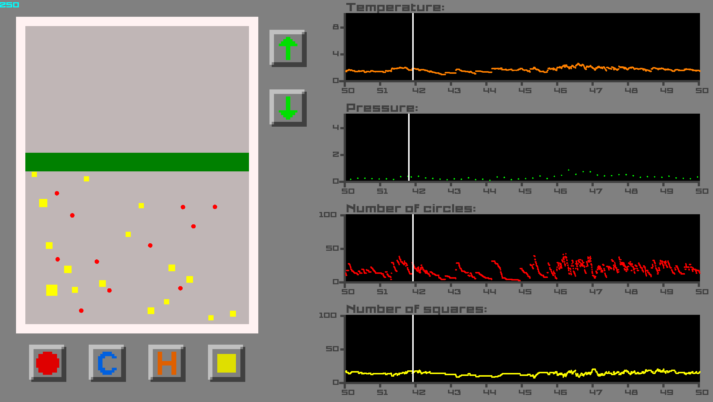

# Симулятор химической реакции

## Описание


При запуске приложения можно увидеть: реактор, кнопки для управления реакцией, графики давления, температуры и количества частиц.
В реакции участвуют два типа частиц: круги и квадраты.
Все частицы отскакивают от поршня и стенок реактора.
Если происходит столкновение двух частиц:
* два круга превращаются в квадрат
* квадрат поглощает круг
* два квадрата рассыпаются на маленькие круги

### Назначение кнопок
С помощью кнопок со стрелками можно контролировать положение поршня.\
С помощью кнопок с кругом и квадратом можно добавить в реактор новые частицы.\
С помощью кнопок C и H можно охладить или нагреть стенки реактора.


## Запуск
Перед сборкой нужно установить [SFML](https://www.sfml-dev.org/download.php)
```
make prepare
make reactor
./reactor
```
